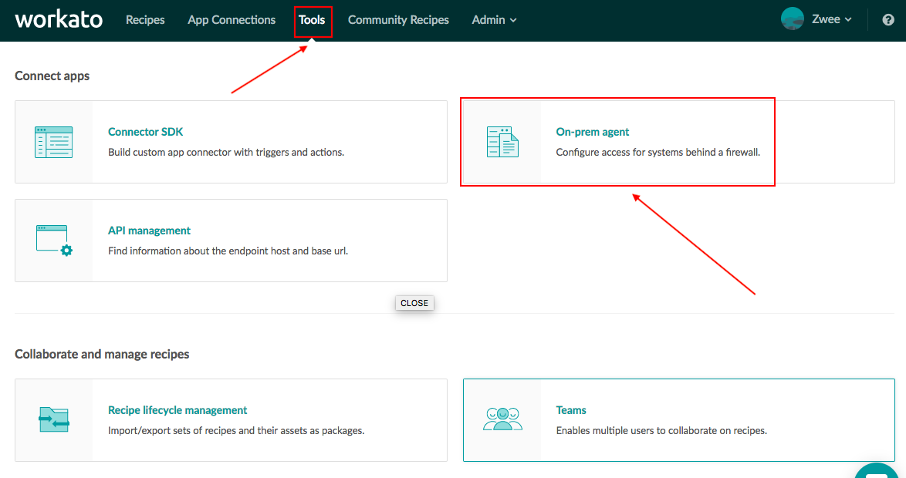
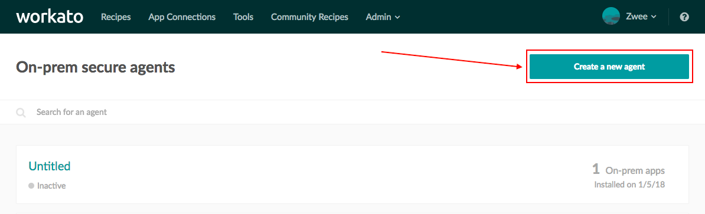
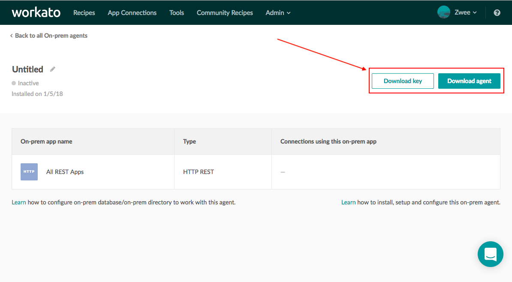
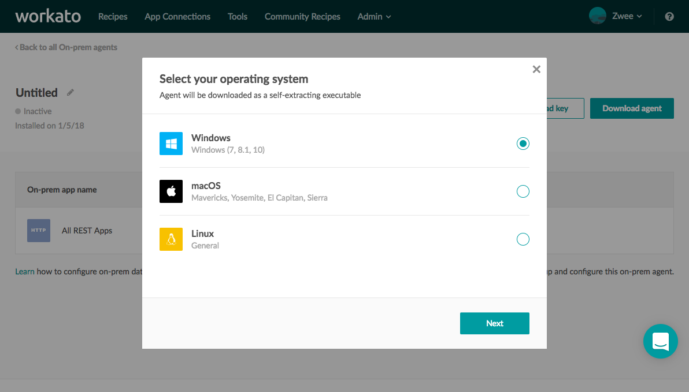

# On-premise access
Enterprises have on-premise applications and databases that are deployed within their corporate datacenter. These apps are protected via firewalls, and therefore are typically not easily accessible to cloud services like Workato.

The Workato on-premise agent provides a secure way for Workato to selectively access customer-authorized on-prem apps, databases and folders without having to open ‘ports’ in the corporate firewall.

On-premise access is enabled only for certain plans. Check the [Pricing and Plans page](https://www.workato.com/pricing?audience=general) or reach out to Workato sales representatives at +1 (844) 469-6752 to find out more.

For Workato accounts with on-prem access, users are able to view the on-prem option in the Tools menu.


*On premise menu option*

# On-premise overview
The following is a conceptual model of Workato's on-premise agent and how it interacts with databases and applications behind the firewall.


*Conceptual model for on-prem agent and connector*

Workato on-premise connectivity has 2 core components:

- Tunneling
- Database and filesystem access.

The on-prem agent runs within the customer’s data center, behind the firewall, and establishes a TLS websocket tunnel to connect out to Workato.

The on-prem agent can be configured to access the selected databases and filesystems behind the firewall. Since 2.2.x it also supports connections to [JMS-compliant systems](/connectors/jms.md).

# Supported operating systems
The on-prem agent runs on the following systems:

- Linux (64-bit)

- Windows 7, 10 (64-bit)

- Mac OS X

Minimum hardware requirements for the system running the on-prem agent are:

- 8GB of RAM
- 250 MB of disk space
- 800 Mhz 64-bit CPU (Intel/AMD).

Please make sure that TCP port 3000 is available for binding.

# Setting up on-prem access

1. [Install agent](/on-prem.md#install-agent)

2. [Create connection profiles](/on-prem.md#create-connection-profiles)

3. [Start agent](/on-prem.md#start-agent)

## Install agent
### For Windows
1. On the top navigation bar, click `Tools` > `On-prem agent`


2. Click `Create a new agent`



3. Click `Download key` and `Download agent`, which downloads a `cert.zip` file and an agent installer/package file respectively.



4. Select your operating system to download the right agent installer/package.



5. Run the agent installer file. Then follow the installation instructions.
6. By default, the agent is installed into `C:\Program Files\Workato Agent` folder and creates a `Workato` group in the Start Menu.
7. By default, the agent is installed as a Windows service called `WorkatoAgent`. You can disable this feature by unchecking the corresponding option during install.
8. Unzip the `cert.zip` file to `Workato Agent\conf` directory. This should copy the `cert.key` and `cert.pem` files to the directory.

An installation instruction video for Windows is also available [here](https://www.youtube.com/watch?v=Pu3GCk7OY6Q&feature=youtu.be).

### For Linux & Mac OS
1. On the top navigation bar, click `Tools` > `On-prem agent`


2. Click `Create a new agent`


3. Click `Download key` and `Download agent`, which downloads a `cert.zip` file and an agent installer/package file respectively.


4. Select your operating system to download the right agent installer/package.


5. Unpack the agent package file into a folder of your choice, which we will refer to as `<INSTALL_HOME>` folder.
6. Unzip the `cert.zip` file to `<INSTALL_HOME>/conf` directory. This should copy the `cert.key` and `cert.pem` files to the directory.

## Create connection profiles
A single Workato agent can be used to connect with multiple backend apps. A `connection profile` uniquely identifies the back end app and contains the configuration information required to connect to that app.

Edit `<INSTALL_HOME>/conf/config.yml` file to configure your database connection profiles and filesystem access.

```YAML
database:
  profile1:
    ...
  profile2:
    ...

files:
  profile1:
    ...
  profile2:
    ...
```

### Database connection profile
Database connection profiles are located in the `database` section of `<INSTALL_HOME>/conf/config.yml`.
The following databases are supported by the on-prem agent:
* `mysql` for MySQL
* `sqlserver` for Microsoft SQL Server
* `oracle` for Oracle Database
* `postgresql` for PostgreSQL.

A database type is specified either by `adapter` property or a complete JDBC URL provided in the `url` property.
Port numbers can be omitted when matching defaults for a given database type.

The example below has a `connection profile` named `marketing`. Do not use spaces or special characters in `connection profile` names.

SQL Server URL-based sample configuration for connecting to specific instance:

```YAML
database:
  sales:
    url: jdbc:sqlserver://server\instance;databaseName=sales
    username: joe
    password: Secret123
    ApplicationName: workato
```

PostgreSQL URL-based sample configuration:

```YAML
database:
  sales:
    url: jdbc:postgresql://sales.database:5432/sales
    username: joe
    password: Secret123
    ApplicationName: workato
```

### JMS connection profile
JMS connection profiles are located in the `jms` section of `<INSTALL_HOME>/conf/config.yml`.
A JMS provider is specified by `provider` property of a connection profile.
The following JMS providers are supported by the on-prem agent:
* `amazon-sqs` or `sqs` for Amazon Simple Queue Service
* `activemq` for Apache ActiveMQ.

#### Amazon SQS
You need the following configuration properties when connecting to Amazon SQS:
```YAML
jms:
  MyAmazonProfile:
    provider: amazon-sqs
    region: <Your Amazon API region, eg 'us-east-2'>
    accessKey: <Your Amazon API access key>
    secretKey: <Your Amazon API secret>
```

Note that you need to make sure your SQS queue is created before sending messages.

#### Apache ActiveMQ
For connecting to a running ActiveMQ broker you only need to specify broker URL:
```YAML
jms:
  MyActiveMQProfile:
    provider: activemq
    url: tcp://localhost:61616
```

ActiveMQ broker cannot be embedded into the agent. Using any `vm://` broker connections is not supported.

### On-premise files connection profile
Working with on-prem files requires you to define a filesystem profile in the `files` section.
You need to specify the base folder for file access; the base folder will be used for resolving relative paths.

```YAML
files:
  hrfiles:
    base: "C:/Documents/HR"
```

For example, if we were to access the on-prem-file folder on the Desktop, the configuration will have a file path that looks something like this: 


*Configuration of on-prem-file folder on Desktop*

The file path can be found when you right-click on the folder, and select **get info** or **property**.

### Apache Kafka
Kafka connection profiles are located in the `kafka` section of `<INSTALL_HOME>/conf/config.yml`.
You need the following configuration properties when connecting to Kafka:
```YAML
kafka:
  MyKafkaProfile:
    ... connection properties ...
```

You can provide any Kafka [consumer](https://kafka.apache.org/documentation/#producerconfigs) or [producer](https://kafka.apache.org/documentation/#newconsumerconfigs) configuration properties, e.g. `bootstrap.servers` or `batch_size`.

However, some properties are overriden by Workato Agent and cannot be configured. You will get a warning when trying to redefine a protected property. Some examples of these protected properties:

| Property name | Comment |
|------------------|-------------------------------------------|
| key.serializer | Only StringSerializer is supported by agent |
| value.serializer | Only StringSerializer is supported by agent |
| key.deserializer | Only StringSerializer is supported by agent |
| value.deserializer | Only StringSerializer is supported by agent |
| auto.offset.reset | Defined by recipes |
| enable.auto.commit | Defined internally |

Workato Agent also supports the following (non-Kafka) configuration properties:

| Property name | Description |
|------------------|-------------------------------------------|
| timeout | General operation timeout, milliseconds. |
| url | Comma-separated list of server URLs where protocol is either `kafka` or `kafka+ssl`. |
| ssl.truststore | Allows inlining of PEM-encoded truststore for secure connection to Kafka |
| ssl.keystore.key | Allows inlining of private key for secure connection to Kafka |
| ssl.keystore.cert | Allows inlining of client certificate for secure connection to Kafka |

`ssl.*` options above can be used when connecting to Kafka using SSL/TLS and allows you to keep PEM-encoded certificates and private keys inside the `config.yml` file. Any YAML-compatible multiline syntax could be used, for instance:

```YAML
kafka:
  MyKafkaProfile:
    ssl.truststore:
    |
      -----BEGIN CERTIFICATE-----
      502mPNNAYkY4a7Zu84DLCXLFurEa4BhLBqLkzC6WdTrBN9z6Rp/svTIl6VgjSTP6
      .....
      -----END CERTIFICATE-----
```

Note that password-protected private keys cannot be inlined.

### Password encryption

To avoid exposure of any sensitive data (like passwords or private keys) you have a choice to encrypt it by using the encryptor tool. The process of encrypting any secret value is as follows:

- Make sure you have your agent keys properly downloaded and placed into `conf` folder. They are required for encryption.
- Run the encryptor tool. Use `bin\encryptor.cmd` in Windows, `bin/encryptor.sh` script for Unix/MacOS.
- When prompted, enter your secret value twice.
- The script will print an encrypted text.
  Example:
  ```
  {encrypted: 'RCVtuGPjJWNqwkFQvhT...'}
  ```
- Copy and paste the provided text as a value inside `config.yml`. Make sure your value is one-line.
  For example, in a database profile:
  ```YAML
  database:
    sales:
      url: jdbc:postgresql://sales.database:5432/sales
      username: joe
      password: {encrypted: 'RCVtuGPjJWNqwkFQvhT...'}
  ```

The encryption is based on your agent's private key. You cannot use encrypted value from one agent inside another agent's configuration. Note that only YAML values can be encrypted (you cannot encrypt YAML property keys).

### Proxy server support

The on-prem agent can be run in the environment with limited internet connectivity by using a proxy server.
Proxy settings can be defined by adding a top-level `proxy` section to the configuration file:

```YAML
proxy:
  host: 192.168.1.1
  port: 8080
  username: proxy_user
  password: proxy_password
```

(username and password are optional)

Using a proxy server for establishing a secure tunnel requires a support for [CONNECT](https://en.wikipedia.org/wiki/HTTP_tunnel#HTTP_CONNECT_tunneling) feature; make sure the proxy server is configured to allow `CONNECT` requests to the Workato gateway (`sg.workato.com`).

### Accessing HTTPS resources

`http` configuration section allows configuring agent access to internal HTTPS resources:
```YAML
http:
  trustAll: true
  verifyHost: true
```

The agent may be configured to allow accessing internal HTTPS resources which use self-signed certificates. To enable self-signed certificates set `trustAll` property to `true`.

Normally a server certificate's Common Name (or Subject Alternate Name) field should match the target hostname. If you want the agent to accept server certificates with non-matching hostname, disable hostname verification by setting `verifyHost` property to `false` (defaults to `true`).

### Applying new configuration

A running on-prem agent automatically applies any changes made to the configuration file. Changes to proxy server settings require you to restart the agent.

## Start agent

### Windows 64-bit
The on-prem agent can be run as a Windows console application or as a Windows service.

Run the on-prem agent in console mode by launching by `Workato` &rarr; `Run Agent (console)` shortcut in the Start Menu.
You can use `Run Agent (console)` shortcut to ensure the agent is successfully connecting to Workato using the provided certificate.

#### Using Windows Service
* Installer automatically registers the agent as a Windows service called `WorkatoAgent`.
* Note: Workato agent is not auto-started by default. Open **Control Panel &rarr; System and Security &rarr; Administrative Tools &rarr; Services &rarr; WorkatoAgent** service configuration to configure service auto-start.

#### Browsing log files
* When the on-prem agent is running as a Windows service, log files can be found at: `%SYSTEMROOT%\System32\LogFiles\Workato`. There's also a shortcut to Workato log directory in the `Workato` group found in Start Menu for convenience.

### Linux 64-bit and Mac OS X
Run the on-prem agent using the following bash script:
```
<INSTALL_HOME>/bin/run.sh
```

## Creating connections
There are no differences in how you work with on-prem apps within your recipe, but on-prem app connections do require special configuration. An on-prem app connection needs to point to a on-prem agent and a specific `connection profile`.

### Connecting to database profiles
Select the correct on-prem agent from the pick list. Once you select the on-prem agent, enter the `connection profile` name as entered in the `database` section of the `config.yml` configuration file.


### Connecting to on-premise file system profiles
You can customize your connection name. Under the on-prem secure agent and connection profile, provide the corresponding agent name and connection profile respectively. Next, click on **connect**. Once your connection is successful, you can proceed to use the connector in your recipe.


*Connection configuration on Workato*

## Common errors when using the on-prem agent
If connecting to on-prem applications fail, check that:
- Selected agent is active
- Credentials provided in the app connection are correct
- Credentials of user provided in the app connection has correct role and permission to connect

If connecting to on-prem databases fail, check that:
- Selected agent is active
- Credentials provided in the connection profile are correct
- Database name and type provided in the connection profile is correct

## Upgrading to the new version
Follow the instructions below for upgrading an existing agent:

### Windows
- Download the installer
- Verify that the agent is stopped (either stop **Workato Agent** Windows service or terminate console-based agent)
- Uninstall the agent (e.g.  **Start Menu &rarr; Workato &rarr; Uninstall**). This should not change the `config.yml` file and the certificate files (`cert.key`, `cert.pem`) in the conf directory
- Run the downloaded installer (this will automatically install to the same location)
- Run the agent. Depending on the setup, either start **Workato Agent** Windows service or run console-based agent
- Make sure your agent is active and verify its version number on the agent page (**Workato.com &rarr; Tools &rarr; On-prem agent**)

### Linux/MacOS
- Verify that the agent process is stopped. The upgrade will fail if any running agents are detected.
- Run the upgrade script: `bin/upgrade.sh`. Make sure you have enough permissions.
- Follow the instructions provided by the upgrade script. Confirm the upgrade when prompted.
- Upon successful completion of the upgrade, run the agent (e.g. `bin/run.sh`)
- Make sure your agent is active and verify its version number on the agent page (**Workato.com &rarr; Tools &rarr; On-prem agent**).
- Upgrade process is not triggered if no new versions are available. However, it might be necessary to repair a broken installation, in that case use the command line option when running the upgrade: `bin/upgrade.sh --enforce`.

## Example recipes

### Example on-premise database recipes
- [Salesforce case sync with on-prem SQL Server](https://www.workato.com/recipes/280605)
- [Quickbase data sync with SQL Server](https://www.workato.com/recipes/280610-demo-qb-data-sync-with-sql-server#recipe)
<!---[On-prem Postgres sync with Postgres](https://www.workato.com/recipes/268936)-->
